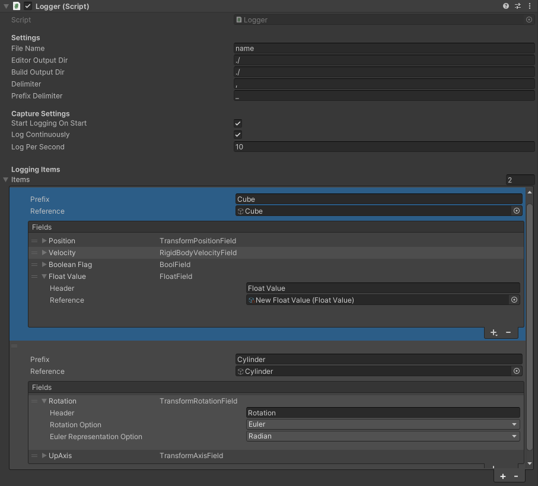
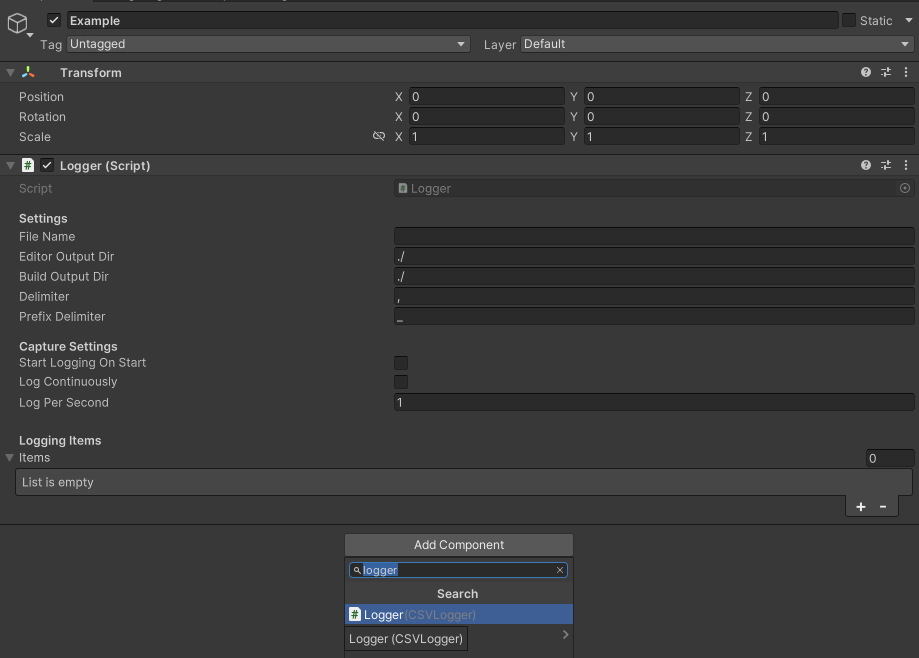
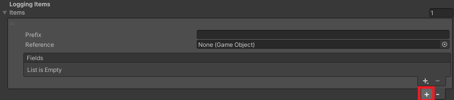
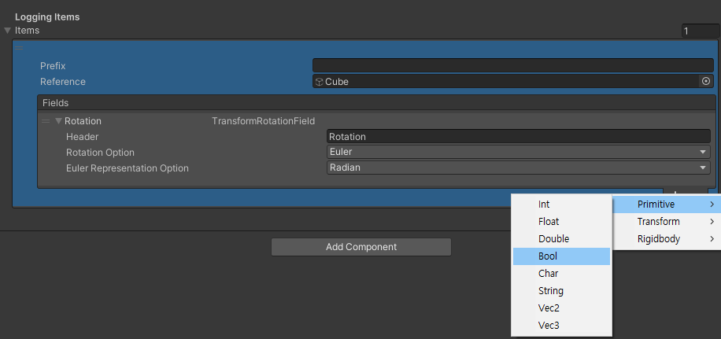
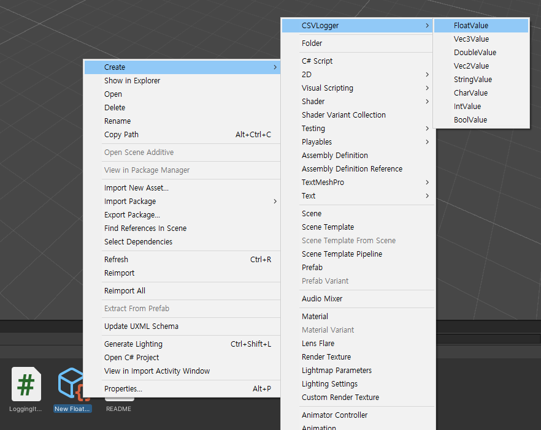
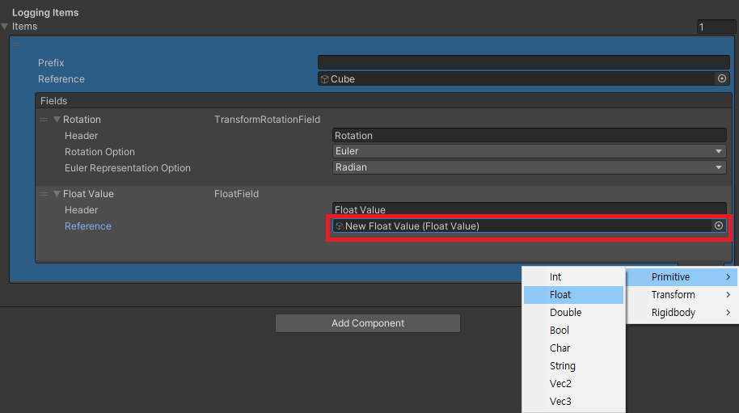

# Modular CSV Logger


An easy-to-use and general-purpose CSV logger in Unity.

## Features
* Ready-to-use logging system for common components such as `Transform`, `Rigidbody` and more.
* Fully modulated and therefore easy to modify and integrate into your codebase.
* Manual logging for trial-based experiments

# NOTE
This repository may cause errors in Unity 6 due to the modifications to their API. Please update the code manually for now if you are using Unity 6. 

# Getting Started
Modular CSV Logger is currently in development. It is not guaranteed that the newer versions of CSV Logger will be backward-compatible. Therefore, it is recommended to include this repository as a submodule to your project:
```
$ git submodule add https://github.com/seung-cha/UnityModularCSVLogger.git
```
> For Unity to recognise this repository, it must be placed inside Assets/ 

* Add the logger to your scene




That's all!


## Adding Data to Capture
* Add `Logging Item`.




`Logging Item` is a placeholder for `ItemField`. Think of `Logging Item` as a class and `ItemField` as class fields. `Logging Item` simply provides necessary object references to `ItemField` so that they can capture and log data.


* (Optional) Add a prefix, if it's necessary to capture multiple data from the same object.
* (Optional) Add an object reference, if it's necessary to capture component-specific data (e.g Rigidbody.velocity)

* Add Fields



* Modify the header. In the file, it will be recorded as {prefix}{prefix_delimiter}{header} (if prefix is not empty)

## Logging Primitive Data
Modular CSV Logger uses ScriptableObject to capture primitive data. This allows for ease of integration to your codebase.

* In the file browser, Right click - Create - CSVLogger - Select a primitive object



* Add reference to the scriptable object in `ItemField`



* In your code, modify the value of the scriptable object

```cs
CSVLogger.FLoatValue floatValue;

...
floatValue.Value = ...
```

Due to the way ScriptableObjects works in Unity, it is recommended to explicitly initialise the value of ScriptableObjects before use.

```cs
void Start()
{
    floatValue.Value = 0.0f;
}
```

## Script Reference
* CSVLogger.Logger : Monobehaviour
    * StartLogging()
    * FinishLogging()
    * Log() (Use this for trial-based experiments)
    * int LogPerSecond {get; set;}
    * bool LogContinuously {get; set;}

# List of Available ItemField
* Primitives
    * Int
    * Float
    * Double
    * Bool
    * Char
    * String
    * Vec2
    * Vec3
* Transform
    * Position
    * LocalPosition
    * Rotation
    * LocalRotation
    * Axis (left, right, up, down, forward, back)
* Rigidbody
    * Velocity
    * Angular Velocity


# How to Contribute
TODO


